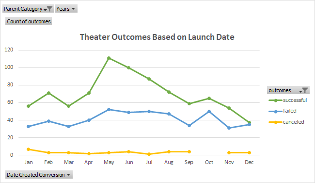
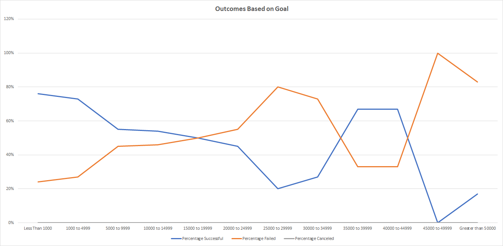

# Kickstarting with Excel

## Overview of Project

### Purpose
The purpose of this data analysis was to show how fundraising campaigns for theaters and plays fared in relation to their launch dates and their fundraising goals.

## Analysis and Challenges

### Analysis of Outcomes Based on Launch Date
Using a pivot table, I was able to create a dotted line chart that shows the number of successful, failed, and canceled theater fundraising campaigns by month.



Based on the chart, we can see that theater fundraising campaigns are most successful in May and June, and least successful at the beginning and end of the year.

### Analysis of Outcomes Based on Goals
To see how the fundraising campaigns of plays fared in relation to their fundraising goals, I created a line chart showing the percentage successful, failed, and canceled based on the fundraising goals.
To create the line chart, I first created a table with:

- the goals separated into 12 different categories (i.e. Less than 1000, 1000 to 4999, 5000 to 9999, etc. up to Greater than 50000);
- the number successful, failed, and canceled with their respective percentages using a COUNTIFS formula;
- and the total number of campaigns for each goal.

For example, to find out how many plays were successful with a goal of less than 1000, I used the following formula:

```
=COUNTIFS(Kickstarter!D:D,"<1000",Kickstarter!R:R,"plays",Kickstarter!F:F,"successful")
```

Using the table, I was able to create the line chart showing the outcomes based on the goals.



Based on the chart, we can see that as the goal increases, the less successful the play fundraising campaign becomes, with an exception of goals between $35000 to $44999. 

### Challenges and Difficulties Encountered
While I did not encounter any challenges or difficulties during this data analysis, there were a couple areas that could have been potentially problematic. One of these areas could have been with creating the pivot table for the Theater Outcomes Based on Launch Date chart. Knowing which fields to put for the columns, rows, and values while also regrouping the dates can be complicated. The COUNTIFS formulas for the Outcomes Based on Goal chart could also be potentially difficult since there are three variables to work with and having to make sure that the formulas work and are correct.

## Results
- We can conclude that a theater fundraising campaign launched in either May or June are the most successful. This might be because with summer nearing, warmer weather, and school letting out, more people have an interest in going to the theater, and in turn, supporting them. This is also a period where many people are receiving their tax returns and they might feel more generous in supporting theaters.
- We can also conclude that as the goal of a play fundraising campaign increases, the greater the chance the fundraising campaign will fail. Goals with less than $1000 were 76% successful and goals that were between $1000 and $4999 were 73% successful. On the other hand, goals between $45000 and $49999 were 0% successful and goals greater than $50000 were 17% successful.
- 

